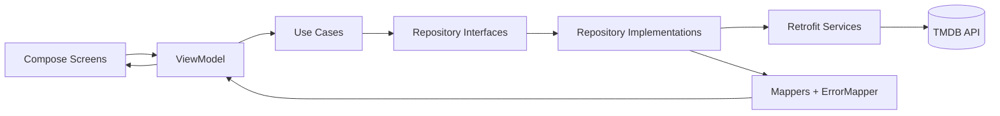
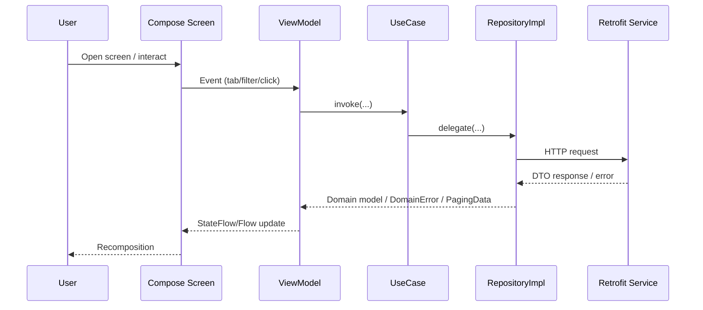
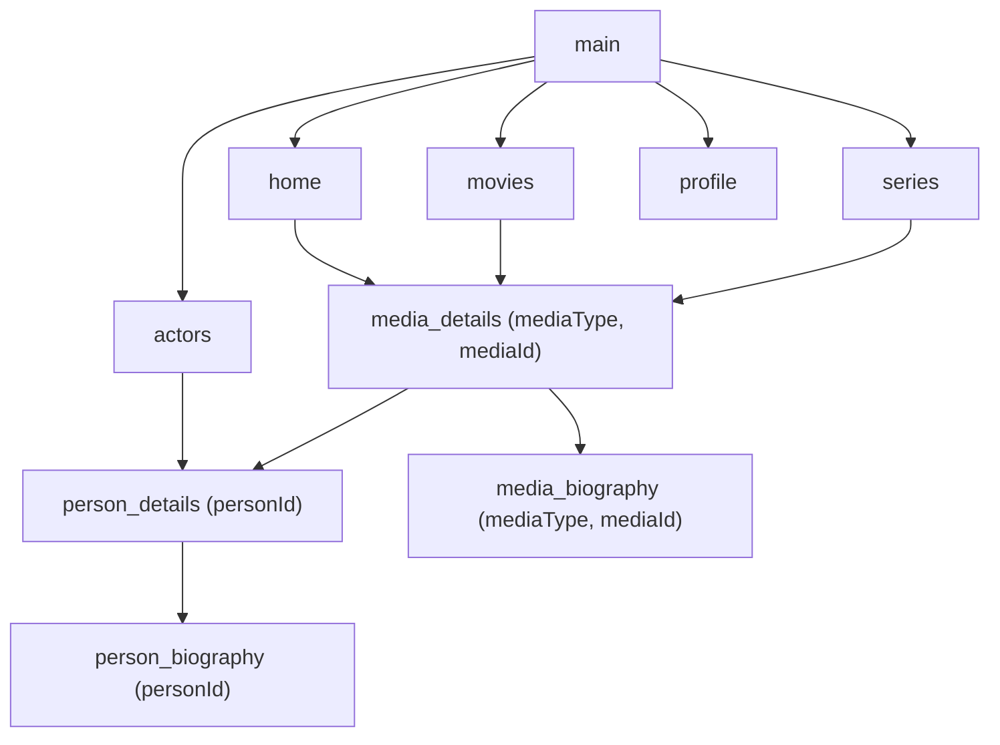
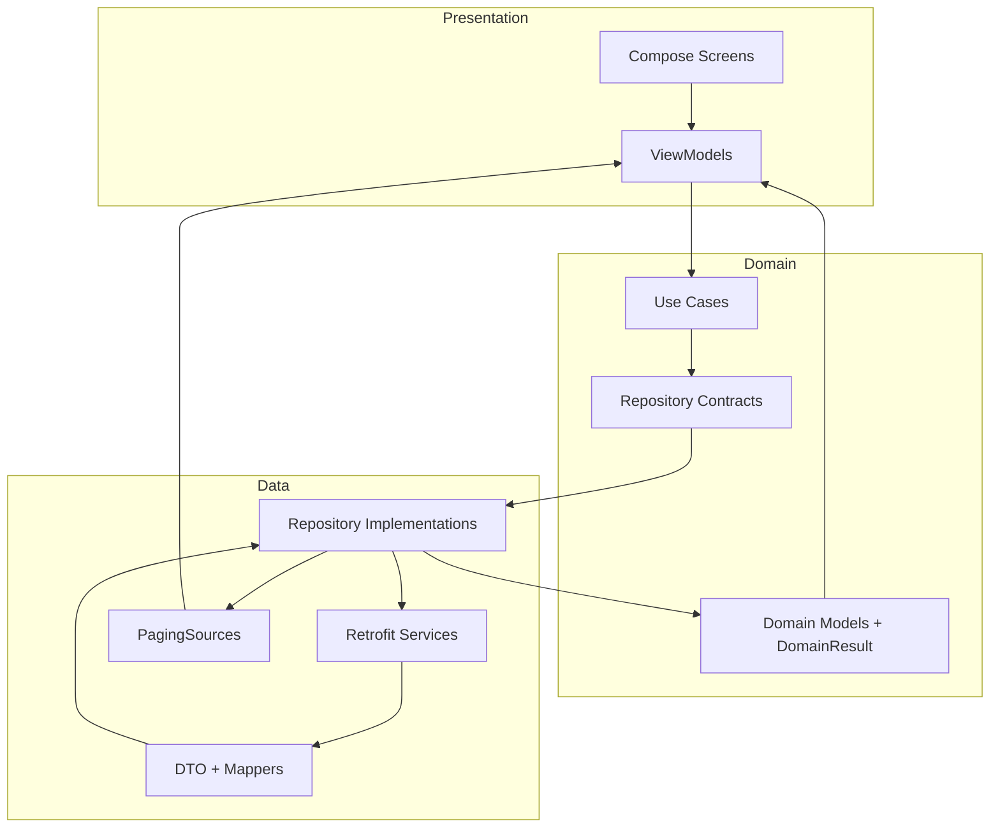

# MyDearMovies

## Project Overview

MyDearMovies is an Android application built with Jetpack Compose that lets users browse movies, TV series, trending content, trailers, and popular people data from TMDB.

The app is organized as a production-style layered architecture with:

- A Compose-driven presentation layer
- A use-case driven domain layer
- A remote-first data layer using Retrofit + Paging 3
- Dependency injection via Hilt

At runtime, the app supports:

- Bottom-tab browsing (`Movies`, `Series`, `Home`, `People`, `Profile`)
- Detail pages for media and people
- Biography pages for expanded text content
- Filtering, sorting, and watch-provider selection for media discovery

---

## Architecture

The project follows **MVVM + Clean Architecture principles** (pragmatic/Android-first variant).

### Layer Responsibilities

### Presentation Layer

- Implemented with **Jetpack Compose**
- Screen state is managed in **ViewModels**
- `StateFlow` and `Flow<PagingData<...>>` drive reactive UI rendering
- UI collects state using `collectAsStateWithLifecycle()` and `collectAsLazyPagingItems()`

Main ViewModels:

- `HomeViewModel`
- `MoviesViewModel`
- `SeriesViewModel`
- `PeopleViewModel`
- `MediaDetailsViewModel`
- `MediaBiographyViewModel`
- `PersonDetailsViewModel`
- `PersonBiographyViewModel`

### Domain Layer

- Defines business models and contracts
- Contains repository interfaces and use cases
- Uses `DomainResult` and `DomainError` for typed success/failure in non-paging use cases

Main components:

- Models: `ContentModel`, `MediaDetailModel`, `PersonDetailModel`, `WatchProviderModel`, etc.
- Use cases: `GetMediaDiscoverUseCase`, `GetMediaDetailsUseCase`, `GetPersonDetailsUseCase`, etc.
- Contracts: `HomeRepository`, `MediaRepository`, `PeopleRepository`

### Data Layer

- Implements repository contracts
- Calls TMDB APIs via Retrofit services
- Maps DTOs into domain models
- Uses Paging sources for list endpoints
- Maps failures to `DomainError` through `ErrorMapper`

Main components:

- Services: `HomeService`, `MediaService`, `PeopleService`
- Repositories: `HomeRepositoryImpl`, `MediaRepositoryImpl`, `PeopleRepositoryImpl`
- Paging sources: `ContentPagingSource`, `PeoplePagingSource`, `TrailerPagingSource`, `InMemoryListPagingSource`

---

## Architecture Diagram



---

## System Design

### Key Runtime Patterns

1. **List-based screens** (`Home`, `Movies`, `Series`, `People`)
   - Use `Flow<PagingData<...>>`
   - Render loading/error/content from `LoadState`
2. **Details/Biography screens**
   - Use `StateFlow<SealedState>` (`Loading`, `Success`, `Error`)
   - Resolve route parameters from `SavedStateHandle`
3. **Filtering workflow** (Movies/Series)
   - ViewModel combines tab, watch providers, sort option, advanced filters, and genres
   - Triggers `flatMapLatest` discovery requests

### Data Flow (Detailed)



---

## Navigation Architecture

Navigation is implemented entirely with **Navigation Compose** and uses two NavControllers:

- `rootNavController` for app-level routes
- `tabsNavController` for bottom-bar destinations

### Route Map

Root routes:

- `main`
- `person_details/{personId}`
- `person_biography/{personId}`
- `media_details/{mediaType}/{mediaId}`
- `media_biography/{mediaType}/{mediaId}`

Bottom-tab routes:

- `movies`
- `series`
- `home`
- `actors`
- `profile`

### Navigation Diagram



---

## Package Structure

```text
app/src/main/java/com/example/mydearmovies
|- core
|  |- common/components
|  |- error
|  |- navigation
|  |- network
|  |- paging
|  `- theme
|- data
|  |- di
|  |- model
|  |- remote
|  |- repository
|  `- util
|- di
|- domain
|  |- model
|  |- repository
|  |- result
|  `- usecase
`- feature
   |- home
   |- media
   |- people
   `- profile
```

---

## Libraries and Why They Are Used

- **Jetpack Compose + Material3**: modern declarative UI toolkit
- **Navigation Compose**: in-code typed route orchestration (string-based in this project)
- **Hilt**: dependency injection, object graph and lifecycle scoping
- **Retrofit + Gson**: HTTP client abstraction and JSON parsing
- **OkHttp + Logging Interceptor**: networking stack and request/response logging
- **Paging 3 (+ paging-compose)**: memory-safe, incremental loading for large lists
- **Coil**: image loading in Compose
- **Coroutines + Flow**: asynchronous and reactive streams
- **JUnit4 / MockK / Turbine / Coroutines Test**: unit testing stack
- **Robolectric + Compose UI Test**: local JVM UI rendering tests for Compose screens

---

## State Management

The project uses a hybrid approach:

- **Paging screens**: `Flow<PagingData<T>>` + `LoadState` for loading/error/content
- **Detail screens**: `StateFlow<SealedState>` with explicit `Loading/Success/Error`
- **Filter screens**: multiple `MutableStateFlow`s combined with `combine + flatMapLatest`

Benefits:

- Reactive rendering
- Good cancellation behavior for rapidly changing filters
- Testability with deterministic `Flow` emissions

---

## Testing Strategy

Testing is concentrated in `app/src/test/java` and currently includes:

### 1) Unit Tests

- ViewModels
- Use cases
- Repositories
- Mappers
- Error mapping

Tools:

- `runTest`
- `MockK`
- `Turbine`
- custom dispatcher rules

### 2) Robolectric + Compose Screen Tests

Screen tests exist for key screens and validate:

- initial rendering
- loading state
- success/content state
- error state

Base test infrastructure:

- `roboletric/base/BaseRobolectricTest.kt`
- `roboletric/base/MainDispatcherRule.kt`

### 3) Instrumentation Tests

- Minimal template coverage exists under `androidTest`
- No substantial end-to-end instrumentation suite yet

---

## Build, Run, and Test

### Prerequisites

- JDK 17 (or Android Studio bundled JBR)
- Android SDK matching `compileSdk 36`
- TMDB API key in `local.properties`:

```properties
TMDB_API_KEY=your_key_here
```

### Commands

Build:

```bash
./gradlew assembleDebug
```

Run unit tests:

```bash
./gradlew testDebugUnitTest
```

Run only ViewModel tests:

```bash
./gradlew testDebugUnitTest --tests "*ViewModelTest"
```

---

## Code Organization and Conventions

- Feature-first package grouping (`feature/home`, `feature/media`, `feature/people`)
- Reusable UI extracted to `core/common/components`
- Error translation centralized in `core/error` + `data/util/ErrorMapper`
- Hilt modules separated by concern (`core/network`, `data/di`, `di`)
- Domain contracts keep repository boundaries explicit

---

## Scalability Considerations

What already scales well:

- Clear layer boundaries and use-case orchestration
- Paging-driven architecture for list-heavy UI
- Feature-oriented package split
- DI-based dependency wiring

Potential bottlenecks / future risks:

1. **Single-module architecture**
   - As codebase grows, consider modularization by feature/layer (`:core`, `:feature:*`, `:data`, `:domain`)
2. **Duplication between Movies and Series flows**
   - Extract shared media listing abstractions to reduce divergence risk
3. **Network-only data access**
   - Introduce local cache (Room) for offline mode and startup resilience
4. **Route argument safety**
   - Replace string parsing with typed navigation args where possible
5. **Observability and release hardening**
   - Add structured logging, crash reporting, and stricter release config

---

## Recommended Improvements (Best Practices Gap Analysis)

### High Priority

- Set `HttpLoggingInterceptor` level by build type (`BODY` in debug only)
- Add CI pipeline with at least:
  - `./gradlew lintDebug`
  - `./gradlew testDebugUnitTest`
- Expand instrumentation coverage for critical user journeys

### Medium Priority

- Normalize package naming typo `roboletric` -> `robolectric`
- Consolidate duplicated test utilities (`MainDispatcherRule`) into one canonical location
- Add static analysis (`detekt`/`ktlint`) and enforce in CI
- Add code coverage reporting (JaCoCo) with quality thresholds

### Long-Term

- Introduce feature and data/domain modules
- Adopt a stricter UI-state contract for paged screens (unify error/loading semantics)
- Add repository-level caching and stale-while-revalidate patterns

---

## Additional Technical Diagram: Layered Packaging



---

## Summary

MyDearMovies already has a strong production baseline for a modern Android app:

- Compose-first UI
- MVVM + use-case architecture
- Hilt DI
- Paging-based scalable lists
- Comprehensive local test suite (unit + Robolectric)

The next step toward large-team readiness is to formalize CI quality gates, reduce duplication, improve typed navigation safety, and progressively modularize.

